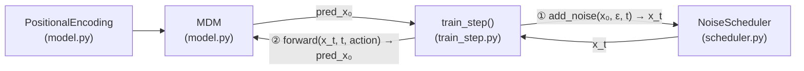
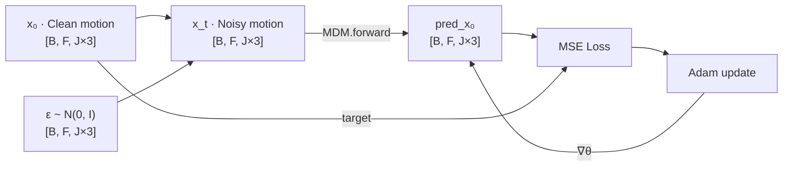

# MDM from Scratch

[](https://arxiv.org/abs/2209.14916)
[](https://www.python.org/)
[](https://pytorch.org/)
[](README_ja.md)

Minimal PyTorch re-implementation of [**"Human Motion Diffusion Model"**](https://arxiv.org/abs/2209.14916) (Tevet et al., ICLR 2023), built from scratch for learning purposes.

> The full official implementation lives in [`reference/`](reference/).

---

## What Is This?

**MDM** generates human motion sequences (e.g., *a person walks forward*) using a **diffusion model** — a generative approach that learns to reverse a process which gradually corrupts data with noise.

This repository is a **minimal, from-scratch implementation** that isolates the core mechanics: the noise scheduler, the Transformer-based denoising model, and the training loop. It intentionally omits CLIP/BERT text encoding, real datasets, and evaluation pipelines so the essential ideas stay readable.

---

## Architecture

The three components and how they connect:



### Data flow — one training step



### Inside `MDM.forward()`

```
action_class ──► Embedding          ──► [B, 1, 512] ─┐
t            ──► Linear → SiLU → Linear ──► [B, 1, 512] ─┤ torch.cat ──► [B, F+2, 512]
x_t          ──► Linear             ──► [B, F, 512] ─┘
                                                         │
                                              PositionalEncoding
                                                         │
                                         TransformerEncoder (8 layers)
                                                         │
                              remove first 2 tokens  ──► [B, F, 512]
                                                         │
                                              Linear  ──► [B, F, J×3]
```

---

## Theory in Brief

MDM is built on [DDPM](https://arxiv.org/abs/2006.11239). The **forward process** adds Gaussian noise to clean motion $x_0$ step by step. In closed form, the noisy motion at any timestep $t$ can be sampled directly:

$$x_t = \sqrt{\bar{\alpha}_t}\, x_0 + \sqrt{1 - \bar{\alpha}_t}\, \varepsilon, \quad \varepsilon \sim \mathcal{N}(0, \mathbf{I})$$

where $\bar{\alpha}_t = \prod_{s=1}^{t}(1 - \beta_s)$ and $\beta_s$ follows a linear schedule from $0.0001$ to $0.02$ over 1000 steps.

The model $f_\theta$ is trained to recover the clean motion from the noisy input. The training objective is:

$$\mathcal{L} = \mathbb{E}_{x_0,\, t,\, \varepsilon}\!\left[\left\| x_0 - f_\theta(x_t, t, a) \right\|^2\right]$$

where $a$ is the action condition. See [docs/decisions.md](docs/decisions.md) for why $x_0$-prediction was chosen over noise-prediction.

---

## File Structure

```
mdm-scratch/
├── model.py          # MDM model: Transformer + PositionalEncoding
├── scheduler.py      # NoiseScheduler: linear beta schedule, add_noise(), step()
├── train.py          # Full training loop on HumanAct12Poses
├── sample.py         # Inference: load checkpoint and generate motion
├── README.md         # This file (English)
├── README_ja.md      # Japanese version
├── examples/
│   ├── train_step.py    # Demo: single training step with dummy data
│   └── sample_step.py   # Demo: single sampling pass (reverse diffusion)
├── tests/
│   ├── test_model.py      # Unit tests for MDM
│   └── test_scheduler.py  # Unit tests for NoiseScheduler
├── .github/workflows/
│   └── test.yml      # GitHub Actions CI: runs pytest on push
└── docs/
    ├── decisions.md     # Architecture Decision Records (English)
    └── decisions_ja.md  # Architecture Decision Records (Japanese)
```

---

## Quick Start

```bash
# 1. Create and activate a virtual environment
python -m venv venv
source venv/bin/activate        # Windows: venv\Scripts\activate

# 2. Install PyTorch (CPU is fine for this step)
pip install torch

# 3. Run one training step (smoke test)
python examples/train_step.py

# 4. Run full training on HumanAct12Poses
python train.py

# 5. Generate motion from a trained checkpoint
python sample.py --checkpoint checkpoints/mdm_final.pth --action_id 1

# 6. Run unit tests
pytest tests/ -v
```

Expected output (train.py):

```
--- トレーニング開始 (device: cpu) ---
Epoch 1/5, Loss: 0.21
...
Epoch 5/5, Loss: 0.05
トレーニング完了。モデルを checkpoints/mdm_final.pth に保存しました。
```

---

## Scope

This implementation covers the **core training loop** only.

| Feature | This repo | `reference/` |
|---|---|---|
| Transformer-based denoising model | ✅ | ✅ |
| Action-conditioned generation | ✅ | ✅ |
| Forward diffusion (`add_noise`) | ✅ | ✅ |
| Reverse diffusion (sampling loop) | ✅ | ✅ |
| Full training loop with real data | ✅ (HumanAct12Poses) | ✅ |
| Unit tests + CI (GitHub Actions) | ✅ | ❌ |
| Text conditioning (CLIP / BERT) | ❌ | ✅ |
| Large-scale datasets (HumanML3D, KIT) | ❌ | ✅ |
| Evaluation metrics (FID, R-Precision) | ❌ | ✅ |
| Visualization (SMPL mesh rendering) | ❌ | ✅ |

The next steps to grow this into a full implementation are documented in [docs/decisions.md — ADR-7](docs/decisions.md#adr-7-simplified-scope--no-text-encoder-no-real-data).

---

## Reference

```bibtex
@inproceedings{tevet2023human,
  title     = {Human Motion Diffusion Model},
  author    = {Guy Tevet and Sigal Raab and Brian Gordon and Yoni Shafir
               and Daniel Cohen-or and Amit Haim Bermano},
  booktitle = {The Eleventh International Conference on Learning Representations},
  year      = {2023},
  url       = {https://openreview.net/forum?id=SJ1kSyO2jwu}
}
```
