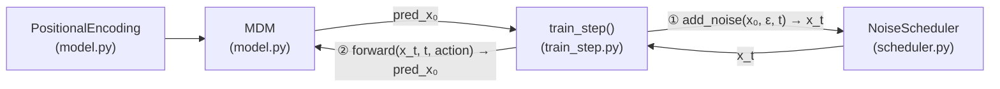
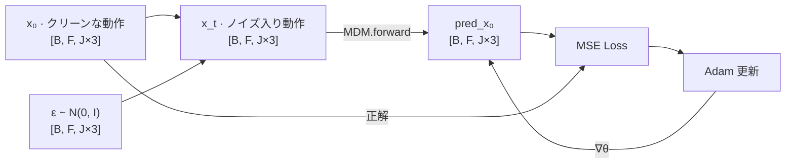

# MDM フルスクラッチ実装

[](https://arxiv.org/abs/2209.14916)
[](https://www.python.org/)
[](https://pytorch.org/)
[](README.md)

[**"Human Motion Diffusion Model"**](https://arxiv.org/abs/2209.14916)（Tevet et al., ICLR 2023）の最小 PyTorch 再実装です。論文のコアメカニズムを理解するために一から書きました。

> 公式の完全実装は [`reference/`](reference/) に収録しています。

---

## これは何？

**MDM** は「人物が前に歩く」といった**人間の動作シーケンスを生成する**モデルです。生成には**拡散モデル（Diffusion Model）**という手法を使っています。

### 拡散モデルとは？

拡散モデルは「ノイズを少しずつ加えてデータを壊す → その逆操作（ノイズを取り除く）を学習する」という発想の生成モデルです。学習済みモデルは、純粋なノイズからスタートしてクリーンな動作データを段階的に復元できます。

このリポジトリは、その仕組みを理解するための**最小実装**です。CLIP/BERTテキストエンコーダ・実データセット・評価パイプラインは意図的に省略し、コアロジックだけを約100行で読めるようにしています。

---

## アーキテクチャ

3つのコンポーネントと接続関係：



### データフロー — 1 トレーニングステップ



### `MDM.forward()` の内部処理

```
action_class ──► Embedding              ──► [B, 1, 512] ─┐
t            ──► Linear → SiLU → Linear ──► [B, 1, 512] ─┤ torch.cat → [B, F+2, 512]
x_t          ──► Linear                 ──► [B, F, 512] ─┘
                                                           │
                                              PositionalEncoding（位置情報を付与）
                                                           │
                                      TransformerEncoder（8 層・自己注意）
                                                           │
                          先頭 2 トークン（条件）を除去 ──► [B, F, 512]
                                                           │
                                              Linear   ──► [B, F, J×3]
```

---

## 理論の要点

MDM は [DDPM](https://arxiv.org/abs/2006.11239) をベースにしています。**フォワードプロセス**では、クリーンな動作 $x_0$ に段階的にガウスノイズを加えます。任意のタイムステップ $t$ でのノイズ入りデータを直接サンプリングできる閉形式は：

$$x_t = \sqrt{\bar{\alpha}_t}\, x_0 + \sqrt{1 - \bar{\alpha}_t}\, \varepsilon, \quad \varepsilon \sim \mathcal{N}(0, \mathbf{I})$$

ここで $\bar{\alpha}_t = \prod_{s=1}^{t}(1 - \beta_s)$、$\beta_s$ は $0.0001$ から $0.02$ への線形スケジュールです（1000 ステップ）。

モデル $f_\theta$ は、ノイズ入り動作 $x_t$ からクリーンな動作 $x_0$ を予測するよう学習します：

$$\mathcal{L} = \mathbb{E}_{x_0,\, t,\, \varepsilon}\!\left[\left\| x_0 - f_\theta(x_t, t, a) \right\|^2\right]$$

$a$ はアクション条件です。なぜノイズ予測でなく $x_0$ 予測を採用したかは [docs/decisions_ja.md](docs/decisions_ja.md) に記録しています。

---

## ファイル構成

```
mdm-scratch/
├── model.py          # MDM モデル本体（Transformer + PositionalEncoding）
├── scheduler.py      # NoiseScheduler（線形ベータスケジュール・add_noise・step）
├── train.py          # HumanAct12Poses を使ったフルトレーニングループ
├── sample.py         # 推論：チェックポイントを読み込んで動きを生成
├── README.md         # 英語版 README
├── README_ja.md      # このファイル（日本語版）
├── examples/
│   ├── train_step.py    # デモ：ダミーデータによる 1 ステップ学習
│   └── sample_step.py   # デモ：1 回サンプリング（逆拡散の動作確認）
├── tests/
│   ├── test_model.py      # MDM のユニットテスト
│   └── test_scheduler.py  # NoiseScheduler のユニットテスト
├── .github/workflows/
│   └── test.yml      # GitHub Actions CI：push ごとに pytest を実行
└── docs/
    ├── decisions.md     # 設計判断の記録 English（ADR）
    └── decisions_ja.md  # 設計判断の記録 日本語（ADR）
```

---

## クイックスタート

```bash
# 1. 仮想環境の作成と有効化
python -m venv venv
source venv/bin/activate        # Windows: venv\Scripts\activate

# 2. PyTorch のインストール（CPU で動作確認可能）
pip install torch

# 3. 1 ステップ学習を実行（スモークテスト）
python examples/train_step.py

# 4. HumanAct12Poses でフルトレーニングを実行
python train.py

# 5. 学習済みチェックポイントから動きを生成
python sample.py --checkpoint checkpoints/mdm_final.pth --action_id 1

# 6. ユニットテストを実行
pytest tests/ -v
```

期待される出力（train.py）：

```
--- トレーニング開始 (device: cpu) ---
Epoch 1/5, Loss: 0.21
...
Epoch 5/5, Loss: 0.05
トレーニング完了。モデルを checkpoints/mdm_final.pth に保存しました。
```

---

## 実装スコープ

このリポジトリは**コアトレーニングループ**のみをカバーしています。

| 機能 | このリポジトリ | `reference/` |
|---|---|---|
| Transformer ベースのノイズ除去モデル | ✅ | ✅ |
| アクション条件付き生成 | ✅ | ✅ |
| フォワード拡散（`add_noise`） | ✅ | ✅ |
| 逆拡散（サンプリングループ） | ✅ | ✅ |
| 実データによるフルトレーニングループ | ✅（HumanAct12Poses） | ✅ |
| ユニットテスト + CI（GitHub Actions） | ✅ | ❌ |
| テキスト条件付け（CLIP / BERT） | ❌ | ✅ |
| 大規模データセット（HumanML3D, KIT） | ❌ | ✅ |
| 評価指標（FID, R-Precision） | ❌ | ✅ |
| 可視化（SMPL メッシュレンダリング） | ❌ | ✅ |

省略した機能とその理由は [docs/decisions_ja.md — ADR-7](docs/decisions_ja.md#adr-7-スコープの絞り込みテキストエンコーダなし実データなし) を参照してください。

---

## 参考文献

```bibtex
@inproceedings{tevet2023human,
  title     = {Human Motion Diffusion Model},
  author    = {Guy Tevet and Sigal Raab and Brian Gordon and Yoni Shafir
               and Daniel Cohen-or and Amit Haim Bermano},
  booktitle = {The Eleventh International Conference on Learning Representations},
  year      = {2023},
  url       = {https://openreview.net/forum?id=SJ1kSyO2jwu}
}
```
